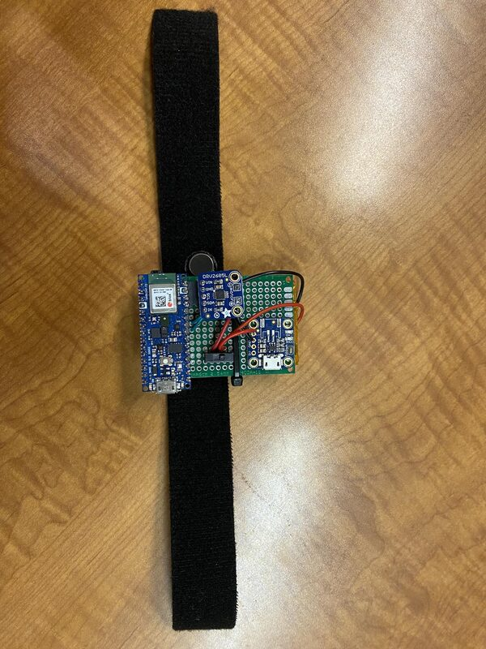
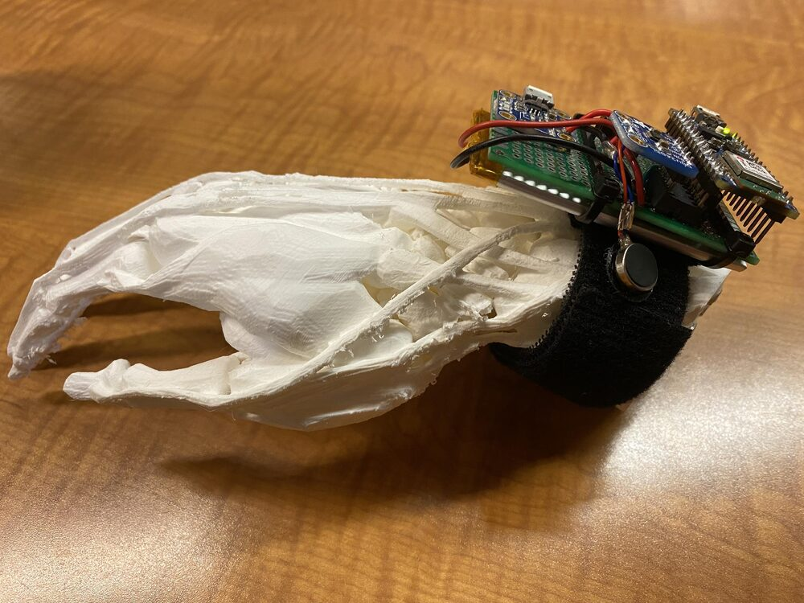
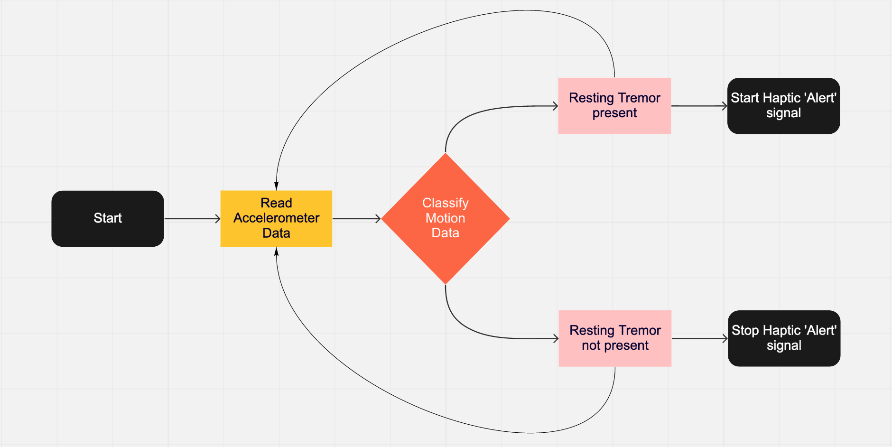
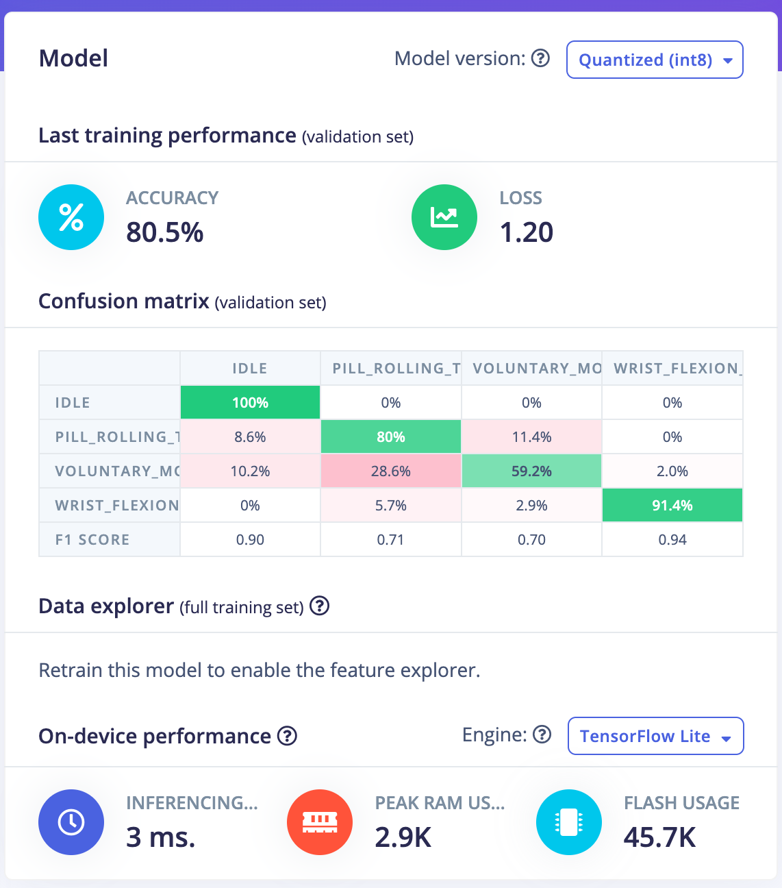
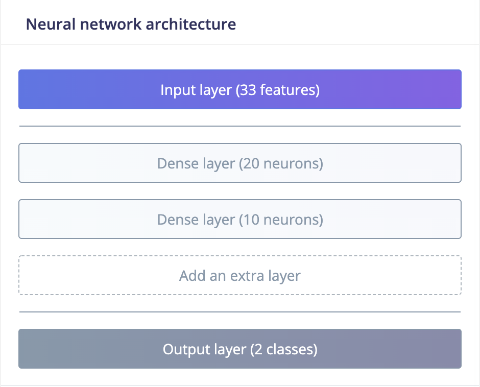
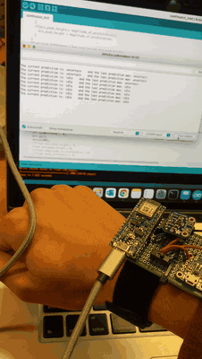
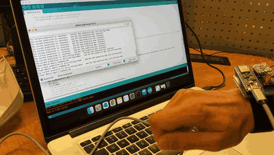
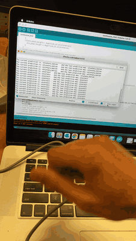

# Parkinson's Tremor Suppression Wearable

A wrist-worn Edge AI device. It classifies hand motion in real time with a small neural network running on an Arduino Nano 33 BLE Sense. When it detects a target motion class, it delivers a haptic cue through a DRV2605L driver and an ERM motor. Everything runs on-device: no phone, no cloud.

Built as the **EE 300W capstone project at The Pennsylvania State University (2021–22)**. Firmware tested April 2022.

<p align="center">
  
  &nbsp;
  
</p>

> **Status:** Research prototype. It has not been clinically validated and is not a medical device. See [Limitations](#limitations).

---

## Why

Parkinsonian **resting tremor** is an involuntary, rhythmic oscillation, typically at 4–6 Hz, that occurs when the limb is at rest and tends to diminish during voluntary movement. Existing treatments each have a cost:

| Approach | Effect | Drawback |
|---|---|---|
| Deep brain stimulation | ~54% mean amplitude reduction (cited in the deck) | Invasive neurosurgery |
| Dopaminergic medication | Significant symptom reduction | Repeated dosing, side effects, interactions |
| Neuromuscular electrical stimulation | Moderate reduction | Electrode placement must be precise |
| Passive orthoses (gyroscopic or restrictive) | Mechanical damping | Bulky |

**Idea:** since resting tremor subsides during voluntary motion, detect the tremor on-device and **cue the wearer with a haptic pulse to make a voluntary movement**. The device is a non-invasive, low-cost prompt, not an actuator that damps the tremor mechanically.

## How it works

<p align="center"></p>

1. **Sensing.** The onboard LSM9DS1 IMU samples 3-axis acceleration and 3-axis angular rate at **119 Hz** into a rolling **1.0 s window** (119 samples × 6 axes). Sampling runs in `loop()`.
2. **DSP (two Edge Impulse spectral-analysis blocks, one for the accelerometer and one for the gyroscope).** Each axis goes through a 6th-order Butterworth **low-pass at 3 Hz**, then a 128-point FFT. Each axis yields 11 features: RMS, the top 3 spectral peaks (frequency and height, threshold 0.1), and spectral power in the bands 0.1–0.5, 0.5–1, 1–2 and 2–5 Hz. That makes 66 features in total.
3. **Classification.** A dense neural network (Keras → TensorFlow Lite Micro, EON-compiled) runs on a background RTOS thread. Each inference is followed by a 200 ms delay, so the classifier runs roughly 4–5 times per second.
4. **Smoothing.** `ei_classifier_smooth` requires 7 of the last 10 predictions to agree, with confidence ≥ 0.8 and anomaly score ≤ 0.3, before it emits a label.
5. **Feedback.** On a qualifying label transition, the DRV2605L plays a waveform from its built-in ERM effect library on the motor.

### Model

| | Capstone model (Dec 2021) | Deployed model (Edge Impulse library v1.0.2) |
|---|---|---|
| Classes | 2 (`idle`, `updown`) | 4 (`idle`, `pill_rolling_tremor`, `voluntary_motion`, `wrist_flexion_tremor`) |
| Input | 33 features (accelerometer only) | 66 features (accelerometer + gyroscope) |
| Architecture | Dense 20 → Dense 10 → Softmax 2 | Dense 80 → Dense 40 → Softmax 4 (8,764 parameters) |
| Validation accuracy | 90% | 80.5% |
| Validation loss | 0.65 | 1.20 |
| Inference latency (on device) | 1 ms | 3 ms |
| Peak RAM / Flash (model only) | 1.7 KB / 19.0 KB | 2.9 KB / 45.7 KB |
| Full firmware build | — | 195,056 B flash (19.8%), 54,736 B RAM (20.9%) |

Accuracy, loss, latency and model memory are Edge Impulse Studio's figures for the validation split (the deployed model's figures are for the int8 build). The full firmware build size is from `arduino-cli` 1.5.1 with `arduino:mbed_nano` 4.6.0.

**Deployed model, validation confusion matrix** (rows = true class):

| True \ Predicted | idle | pill_rolling | voluntary | wrist_flexion | F1 |
|---|---|---|---|---|---|
| idle | **100%** | 0% | 0% | 0% | 0.90 |
| pill_rolling_tremor | 8.6% | **80.0%** | 11.4% | 0% | 0.71 |
| voluntary_motion | 10.2% | 28.6% | **59.2%** | 2.0% | 0.70 |
| wrist_flexion_tremor | 0% | 5.7% | 2.9% | **91.4%** | 0.94 |

The main error mode is **voluntary motion misread as pill-rolling tremor (28.6%)**. The 3 Hz low-pass filter (see [Limitations](#limitations)) is one likely contributor.

<details>
<summary>Edge Impulse screenshots</summary>



</details>

## Demo

The three clips below were recorded with the Arduino Serial Monitor showing live predictions. Full-resolution MP4s are in [`media/`](media).

| Idle | Tremor | Voluntary motion |
|---|---|---|
|  |  |  |

## Hardware

| Part | Role |
|---|---|
| Arduino Nano 33 BLE Sense **Rev1** (nRF52840, Cortex-M4F @ 64 MHz) | MCU + LSM9DS1 IMU |
| Adafruit DRV2605L haptic driver | Drives the ERM motor from the I²C effect library |
| ERM vibration motor | Haptic cue |
| Perfboard, hook-up wire, hook-and-loop strap | Mounting |

**Wiring:** DRV2605L `VIN` → 3.3 V, `GND` → GND, `SDA` → A4, `SCL` → A5, motor leads → DRV2605L `+`/`–`. The IMU is onboard.

> ⚠️ **Rev2 boards are not compatible as-is.** The Nano 33 BLE Sense Rev2 replaced the LSM9DS1 with a BMI270 + BMM150, so `Arduino_LSM9DS1` will fail to initialize. On Rev2 you would need `Arduino_BMI270_BMM150` and a model retrained on data from that sensor.

## Build & flash

1. **Board core.** In Arduino IDE → Boards Manager, install **Arduino Mbed OS Nano Boards** (build verified with 4.6.0). It provides `rtos::Thread`.
2. **Libraries.** In Library Manager, install:
   - `Arduino_LSM9DS1` (build verified with v1.1.1)
   - `Adafruit DRV2605 Library` (build verified with v1.2.4; it also pulls in `Adafruit BusIO`)
3. **Model library.** The sketch includes `P.D._Tremor_Suppression_inferencing.h`. That header comes from the Edge Impulse–generated Arduino library, which is not committed to this repo.
   - **From a release:** download `P.D._Tremor_Suppression_inferencing-1.0.2.zip` from this repo's [Releases](../../releases) page.
   - **Or regenerate it:** in [Edge Impulse Studio](https://studio.edgeimpulse.com), open project *P.D. Tremor Suppression* (ID 65293) → **Deployment** → select **Arduino library** → **Build**. The downloaded zip contains the header.
   - In Arduino IDE → **Sketch → Include Library → Add .ZIP Library…** → choose the zip.
4. **Open** `firmware/Parkinsons_tremor_tested_april2022/Parkinsons_tremor_tested_april2022.ino`, select *Arduino Nano 33 BLE*, and upload.
5. **Monitor** at 115200 baud to see the live predictions.

> The first compile takes several minutes, because the Edge Impulse SDK is large.
>
> **CLI alternative:** `arduino-cli compile -b arduino:mbed_nano:nano33ble firmware/Parkinsons_tremor_tested_april2022`. On macOS, if `ctags: cannot open temporary file` appears, run `export TMPDIR=/tmp/` first.

## Repository layout

```
firmware/Parkinsons_tremor_tested_april2022/   Arduino sketch
docs/capstone-presentation.pdf                 Capstone slides (PDF; .pptx source alongside)
media/                                         Photos, diagrams, demo GIFs/MP4s, model screenshots
```

## Limitations

This section describes the firmware as it currently stands. It is kept deliberately explicit.

- **The trigger condition in firmware.** The *resting-tremor* haptic branch is commented out. The active branch fires on two consecutive smoothed `voluntary_motion` predictions and plays a random DRV2605 effect (1–122).
- **The DSP low-pass cutoff sits below the tremor band.** Parkinsonian rest tremor is typically 4–6 Hz, but both spectral blocks apply a 6th-order Butterworth low-pass at 3 Hz. Using the ideal response |H(f)|² = 1 / (1 + (f/3)¹²), the attenuation is about −15 dB at 4 Hz, −27 dB at 5 Hz and −36 dB at 6 Hz. The highest spectral-power band also stops at 5 Hz. The features therefore weight sub-tremor motion heavily. Retraining with a cutoff of ≥ 8 Hz, or a 3–8 Hz band-pass, is the first thing to try.
- **No efficacy measurement.** The only reported metric is classifier accuracy on a validation split. Tremor amplitude with vs. without cueing has not been measured.
- **Not clinically validated.** The model has not been evaluated on a cohort of people with Parkinson's disease.
- **Known firmware issues** (not yet fixed):
  - `min_peak_height` is initialized to 0, so `peak_difference` equals the max.
  - Floats are printed with `%s`.
  - The sample buffer is shared between threads without a lock.
  - The X and Y accelerometer axes are swapped at read time.
  - `time_to_wait` can underflow if a loop iteration overruns.

## Future work

From the capstone plan:

- Distinguish essential tremor from Parkinsonian resting tremor.
- Map classifications to MDS-UPDRS tremor scores to track disease progression.
- Add BLE sync to a phone app, with cloud upload for retraining.

## Author

**Karthik Madhav Jain**, The Pennsylvania State University.

## License

[MIT](LICENSE)
